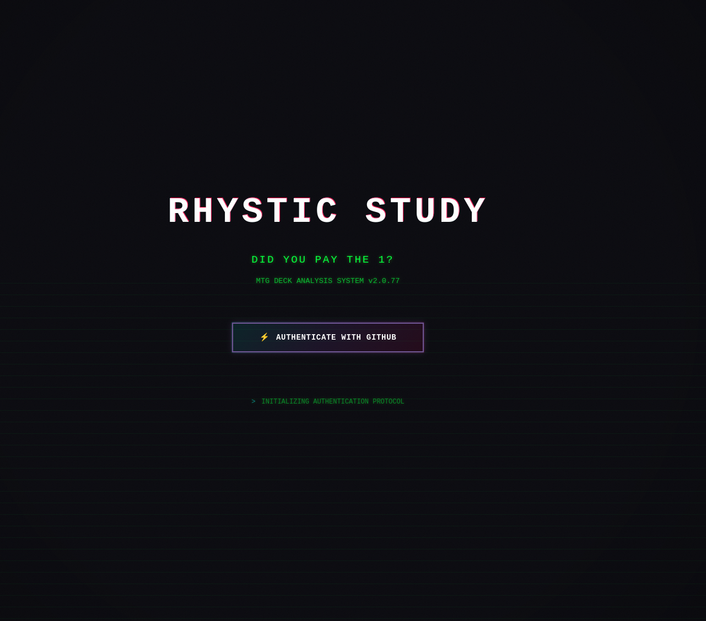
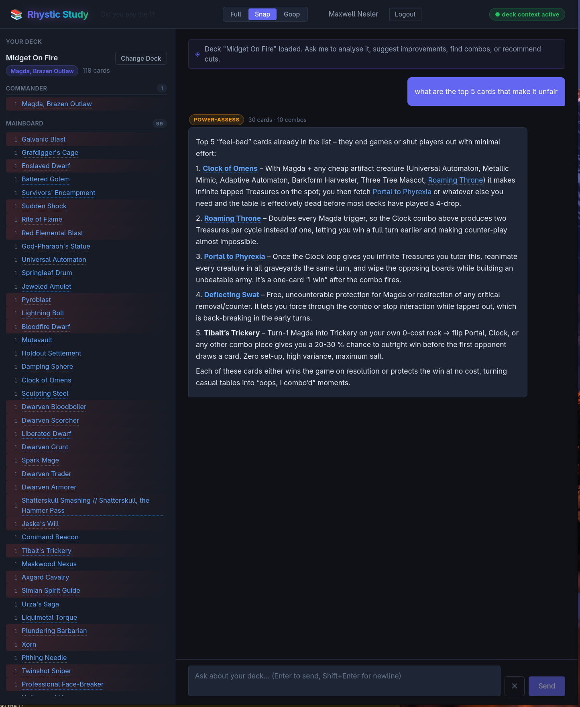

# Rhystic Study

An AI-powered MTG Commander deck assistant that helps you analyze, optimize, and build better Commander decks using RAG (Retrieval-Augmented Generation).





## Features

- **Deck Loading** - Load decks from Moxfield URLs or paste decklists
- **Intent Classification** - Automatically understands what you're asking (card lookups, deck building, combo finding, power assessment)
- **RAG-Powered Retrieval** - Combines SQL lookups with vector similarity search over 30,000+ Magic cards
- **Context-Aware Responses** - Takes your loaded deck into account when answering
- **GitHub OAuth** - Secure authentication via GitHub

## Tech Stack

- **Frontend**: SolidJS + Vite
- **Backend**: Express + TypeScript
- **Database**: SQLite with vector embeddings
- **AI**: OpenRouter API (LLM + embeddings)
- **Deployment**: Google Cloud Run (frontend + backend)

## Data Flow

### 1. Deck Ingestion

```
POST /api/deck/load { moxfieldUrl }
    → fetchMoxfieldDeck() or parseDecklist()
    → LoadedDeck { commanders, cards, cardCount }
    → session.loadedDeck (in-memory session)
```

When you load a deck, it fetches from Moxfield or parses a raw decklist. The deck is stored in the server-side session along with commanders, card list, and metadata.

### 2. Chat Flow

Every message goes through this pipeline:

```
POST /api/chat { message }
    │
    ├─→ STEP 1: Intent Classification [LLM #1]
    │       classifyIntent() - Understand what the user is asking
    │       Input: user message + history
    │       Output: Intent { type, commander, themes, tags, searchQuery }
    │
    ├─→ STEP 2: Retrieval (RAG)
    │       retrieve() - Fetch relevant cards and combos
    │       - SQL exact matches
    │       - Vector similarity search (30K+ card embeddings)
    │       Output: RetrievalResult { cards, combos, hasEmbeddings }
    │
    ├─→ STEP 3: Context Building
    │       buildContext() - Format retrieved data for the prompt
    │       - Enforces ~14K character budget
    │       - Truncates if exceeded
    │
    ├─→ STEP 4: Prompt Construction
    │       Build messages array:
    │       1. System: base guidelines
    │       2. System: deck block (if deck loaded)
    │       3. System: retrieved cards/combos
    │       4. History: last 10 messages
    │       5. User: current message
    │
    ├─→ STEP 5: Stream Answer [LLM #2]
    │       streamAnswer() - Generate response via OpenRouter
    │       Output: SSE stream of tokens
    │
    └─→ STEP 6: Post-Processing
            addAssistantMessage() - Save to history
            Extract and validate card names from response
```

### 3. Retrieval Strategies

Based on the classified intent type:

| Intent Type | Strategy |
|-------------|----------|
| `card-lookup` | Exact name match → fuzzy fallback → vector search |
| `deck-build` | Commander lookup + combos + tags + vector blend |
| `combo-find` | Card → combo lookup → related combos + vector |
| `tag-search` | card_tags join → filter by color → vector blend |
| `power-assess` | Card lookup + combo lookup per card |
| `general` | Pure vector similarity |

### 4. Database Schema

- **cards** - MTG card data (30,395 cards)
- **card_embeddings** - Vector embeddings for semantic search
- **combos** - Pre-defined card combos
- **card_tags** - Manual card tagging

## Local Development

```bash
# Install dependencies
npm install
cd backend && npm install

# Start backend (port 3002)
npm run dev

# Start frontend (port 5174)
cd frontend && npm run dev

# Load cards into database
npm run ingest:scryfall

# Generate embeddings
npm run embed:cards
```

## Environment Variables

### Backend (.env)
```
GITHUB_CLIENT_ID=        # GitHub OAuth app client ID
GITHUB_CLIENT_SECRET=    # GitHub OAuth app client secret
GITHUB_CALLBACK_URL=     # OAuth callback URL
JWT_SECRET=              # Secret for JWT tokens
FRONTEND_ORIGIN=         # Frontend URL for CORS
OPENROUTER_API_KEY=      # API key for LLM
```

### Frontend (.env)
```
VITE_API_URL=            # Backend API URL (empty = relative paths)
```

## Deployment (GCP)

```bash
# Build and push backend
docker build -f Dockerfile.backend -t gcr.io/PROJECT/mtg-backend:latest .
docker push gcr.io/PROJECT/mtg-backend:latest

# Build and push frontend
docker build -f Dockerfile.frontend -t gcr.io/PROJECT/mtg-frontend:latest \
  --build-arg VITE_API_URL= .
docker push gcr.io/PROJECT/mtg-frontend:latest

# Deploy to Cloud Run
gcloud run deploy mtg-backend \
  --image gcr.io/PROJECT/mtg-backend:latest \
  --set-env-vars "FRONTEND_ORIGIN=https://..."

gcloud run deploy mtg-frontend \
  --image gcr.io/PROJECT/mtg-frontend:latest \
  --allow-unauthenticated
```

## License

MIT
